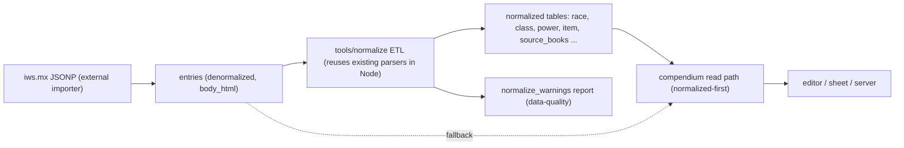

# Normalize the 4e compendium into structured SQLite

## Decisions (confirmed)
- Engine: **normalized SQLite**, kept in the same `data/alter_ego.db` file so the in-browser `sql.js` load, the `better-sqlite3` server read, and the Tauri bundle all keep working unchanged.
- Input: **ETL from the pulled live denormalized DB** (`npm run pull:live-data`).

## Core principle: additive and incremental
Add normalized tables **alongside** the existing denormalized `entries` table. A new read path prefers normalized tables and **falls back to the current parse-from-`entries`/stub path** for any category not yet normalized. Nothing breaks mid-migration; we retire one parser at a time only after parity is proven.

## The date question (answered)
No per-entry date exists. Item fields are only `Name, Category, Type, Level, Cost, Rarity, SourceBook` (`data/samples/compendium-stub.json`); the only date is the catalog-level `catalogTimestamp` in `metadata/catalog-counts.json`. Solution: a **`source_books(code, title, release_date, edition_era)`** table. The GM dates ~50 books once (manual, as expected), and item date filtering becomes a join `item.source_book -> source_books.release_date`. The column ships now; population and the filter UI come later.

## Normalized schema (new tables in alter_ego.db)
Derived tables, regenerated by `npm run normalize` after every import:
- `source_books(code PK, title, release_date, edition_era)` - date-ready.
- `race(id PK, name, origin, size, speed, vision, source_book, body_html)`; `race_ability_bonus(race_id, ability, amount, choice_group, alternatives_json, note)`; `race_skill_bonus(race_id, skill, amount)`; `race_grant(race_id, kind, entry_id)`; `race_subrace(parent_race_id, subrace_race_id)` (replaces `metadata/race-subraces.json`).
- `class(id PK, name, role, power_source, key_abilities, hp_at1_base, hp_per_level, surges_base, base_speed, source_book, is_hybrid, hybrid_parent_class_id, body_html)`; `class_defense_bonus(class_id, defense, amount)`; `class_trained_skill(class_id, skill_id, kind, choose_count)`; `class_build_option(id PK, class_id, label)`; `class_build_suggested(build_id, kind, value)`.
- `power(id PK, name, class_name, level, power_type, action, source_book, body_html)` - normalized `Type`/`Level`/`ClassName` (retires the LIKE patterns in `src/editor/power-filter.js`).
- `item(id PK, name, category, type, level, cost_gp, rarity, source_book, slot)`; `armor_stats(item_id, ac_bonus, check_penalty, is_heavy)`; `weapon_stats(item_id, prof_bonus, damage_dice, group)` (retires the PHB fallback table in `src/character/equipment-stats.js`).
- Keep `entries` for display HTML and fallback.

## ETL tool (`tools/normalize/normalize.mjs`)
Node + `better-sqlite3`. Opens the pulled denormalized DB read-only, **reuses the existing parser modules** (`src/character/race-parse.js`, `class-parse.js`, `background-parse.js`, `equipment-stats.js`) so logic is not duplicated, and writes the normalized tables. Emits a `normalize_warnings` table / console report for entries that fail to parse - this is the payoff: parse failures become build-time data-quality items instead of live runtime bugs (the class of bugs B-010..B-017). Over time the parse logic migrates into the normalizer and the runtime callers are deleted. Wire `npm run normalize` and call it from `scripts/post-build-app.mjs` so the normalized DB ships in `dist/app/`.

## Read-path changes (per category, normalized-first + fallback)
- `src/data/compendium.js` (browser) and `server/compendium.mjs` (server): add `getRace`/`getClass`/`listPowers`/`getItemStats` that query normalized tables when present (table-exists capability check), else fall back to today's `entries`/stub parse path.
- Retire callers one category at a time once parity tests pass.

## Sequencing (each step independently shippable)
1. Pull live DB; snapshot its real schema and distinct `SourceBook` values; confirm the no-date finding against production data.
2. Create normalized schema migration + `source_books` (empty, date-ready) + ETL skeleton with warnings report; `npm run normalize`; post-build wiring.
3. Race + subrace end-to-end; switch race step / `race-subraces.js` to `race_subrace`; keep fallback; parity test.
4. Class incl. `is_hybrid`/`hybrid_parent_class_id`; switch hybrid detection off the `Hybrid ` name prefix; implement the deferred **B-024** merge on normalized class fields (HP average + CON once, surges, combined skills "any three", armor proficiency intersection, weapon/implement union) per the PH3 rules now recorded in `doc/bugs.md`; enforce "not two subclasses of the same class".
5. Powers; switch `power-filter.js` to normalized `power_type`/`class_name`/`level`.
6. Equipment (weapon/armor/implement/item); switch `equipment-stats.js` to stat tables.
7. Background + remaining categories; retire each parser as covered.
8. Future: populate `source_books.release_date` and add the GM date filter UI.

## Tests and docs
- Parity tests in `tests/`: for sampled entries, assert normalized rows equal current parser output before any parser is removed.
- Docs (per repo rule): add `doc/architecture.md` (currently referenced but missing) or a `doc/compendium-schema.md` documenting the normalized schema and ETL; update `doc/files.md`, `doc/project.md`, `doc/bugs.md` (B-003 importer, B-024 merge), `doc/tests.md`, and the `doc/README.md` sync line.
</plan>
<todos>[{"id": "pull-snapshot", "content": "Pull live denormalized alter_ego.db and snapshot its real schema + distinct SourceBook values; confirm no per-entry date in production data."}, {"id": "schema-etl-skeleton", "content": "Create normalized schema migration (incl. source_books date-ready table), the tools/normalize ETL skeleton reusing existing parsers, a normalize_warnings report, npm run normalize, and post-build wiring."}, {"id": "read-path-fallback", "content": "Add normalized-first read methods with parse/stub fallback in src/data/compendium.js and server/compendium.mjs (table-exists capability check)."}, {"id": "race-subrace", "content": "Normalize race + subrace; switch race step and race-subraces.js to the race_subrace table; parity test; keep fallback."}, {"id": "class-hybrid-b024", "content": "Normalize class incl. is_hybrid/hybrid_parent_class_id; switch hybrid detection off the name prefix; implement the B-024 hybrid merge on normalized fields per PH3; enforce not-two-subclasses-of-same-class."}, {"id": "powers", "content": "Normalize powers (power_type/class_name/level) and switch power-filter.js off the LIKE patterns."}, {"id": "equipment", "content": "Normalize weapon/armor/implement/item stats; switch equipment-stats.js to stat tables and retire the PHB fallback table."}, {"id": "remaining-parsers", "content": "Normalize background and remaining categories; retire each runtime parser as it is fully covered."}, {"id": "source-date-filter", "content": "Future: populate source_books.release_date (GM, manual per book) and add the source-by-date filter UI to item pickers."}, {"id": "tests-docs", "content": "Add parser-parity tests; document the normalized schema/ETL and update doc/files.md, project.md, bugs.md, tests.md, and the README sync line."}]