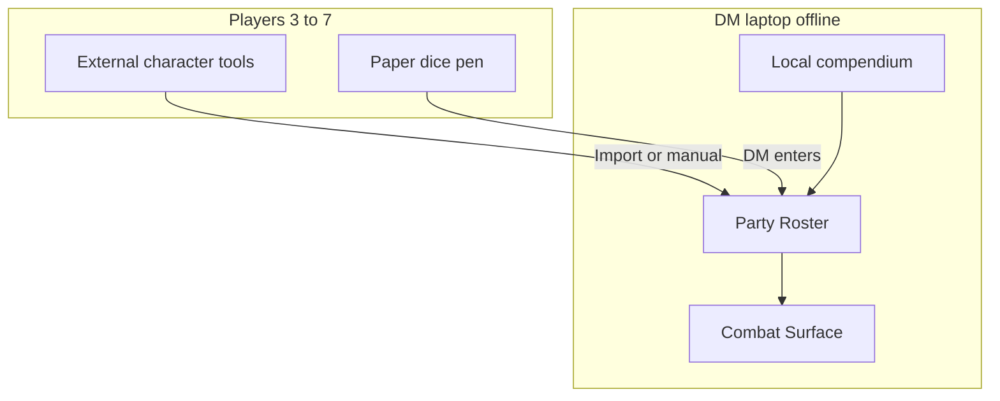
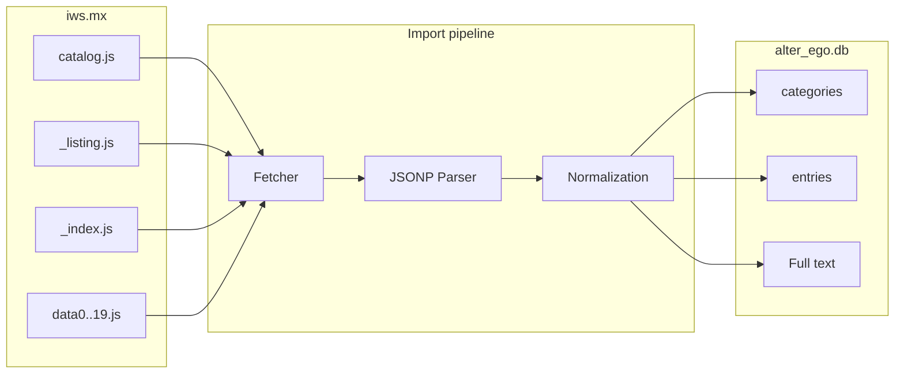
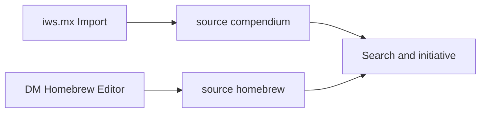
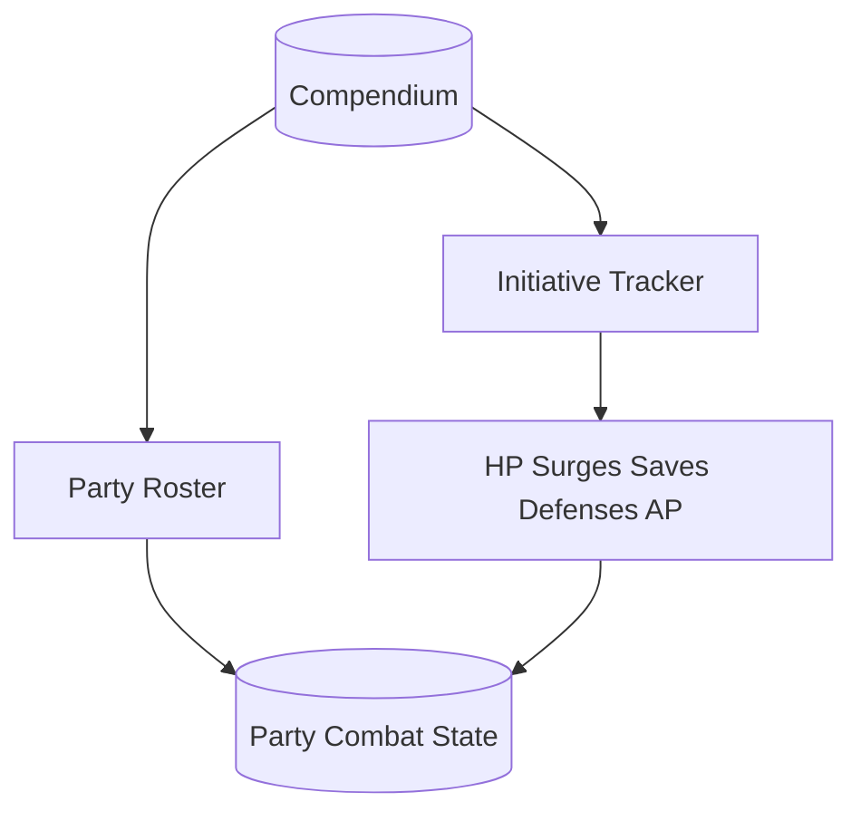

# Alter Ego — project metadata

This file describes purpose, data source, architecture, and implementation phases for **Alter Ego**: an offline-capable toolkit for D&D 4th Edition with a local compendium, party character management (3–7 players), and a DM surface for combat and initiative.

**Status:** Active project — specification (`PROJECT.md`) plus a working web app under `src/` (character sheet, generator, GM, party). Compendium import (`data/alter_ego.db`) is still pending (phase 1).

---

## 1. Project overview

| Field | Value |
|-------|-------|
| **Name** | Alter Ego |
| **Edition** | Dungeons & Dragons 4th Edition (4e) |
| **Audience** | Private table group, 3–7 players |
| **Users at the table** | DM only on the laptop; players use external digital tools or paper/dice/pen |

### Three pillars

1. **Database** — Local 1:1 mirror of the [iws.mx/dnd](https://iws.mx/dnd) compendium (20 categories, exact slugs and columns).
2. **Characters** — Party roster with all PCs; capture via import or manual entry; optional built-in builder later (model: [D&D Beyond](https://www.dndbeyond.com/)).
3. **DM table tool** — Party dashboard and combat surface (initiative, HP, healing surges, saves, defenses, action points, conditions).

### UX model for character editor

[D&D Beyond](https://www.dndbeyond.com/): guided wizard, filtered choices, live validation, character sheet — applied to **4e rules** from the local database (not a 1:1 clone of the D&D Beyond 5e UI).

---

## 2. Emergency constraints (old DM laptop)

| Constraint | Consequence |
|------------|-------------|
| Old/failing DM laptop, outdated OS | Offline-first, no cloud requirement; lean runtime |
| Group of 3–7 | `campaign` → up to 7 active PCs |
| Players: external tools or paper | App = **DM tool**; import or manual core values |
| DM only on laptop | No LAN multiplayer; optional read-only mode on same device |
| DM sees all characters | Party roster + sheet-light per PC |
| DM combat surface | Initiative + per participant: HP, surges, saves, AC/Fort/Ref/Will, AP, conditions |



---

## 3. Source and compliance

| Field | Value |
|-------|-------|
| **Public source** | [https://iws.mx/dnd](https://iws.mx/dnd) |
| **Upstream** | [Sheep-y/trpg-dnd-4e-db](https://github.com/Sheep-y/trpg-dnd-4e-db) (fan remake of the D&D Insider compendium) |
| **Viewer version** | 3.6.x (HTML/JS under `4e_database_files/res/`) |
| **Program license** | GNU **AGPL v3** |
| **Content** | Wizards of the Coast fan content / compendium data |

### Intended use (project scope)

- **Local, private use only** at the game table.
- **No redistribution** of imported compendium raw data without your own license review.
- If the app is published later: comply with AGPL obligations and fan content guidelines.

---

## 4. Data acquisition (iws.mx)

The source is **not** a live SQL API but a **static JSONP export**:

**Base URL:** `https://iws.mx/dnd/4e_database_files/`

| File | Role |
|------|------|
| `catalog.js` | Category slug → entry count |
| `{slug}/_listing.js` | Column names + table rows (list view) |
| `{slug}/_index.js` | Full-text index: `id → plaintext` (full search) |
| `{slug}/data0.js` … `data19.js` | Entry body: `id → HTML` (20 shards: `parseInt(id.match(/\d+/)) % 20`) |

### URL conventions (source)

| Purpose | Pattern | Example |
|---------|---------|---------|
| Name search, category | `?list.name.{slug}` | `?list.name.class` |
| Full-text search | `?list.full.{slug}` | `?list.full.power=fighter%20heal` |
| Entry | `?view.{slug}.{entrySlug}` | `?view.class.ardent` |

### Import recommendation

**No fragile DOM scraper.** Use a structured **JSONP importer** instead:

1. Load `catalog.js` and validate categories.
2. Per slug: `_listing.js`, `_index.js`, all `data*.js` (0–19).
3. Parse JSONP callback (`od.reader.jsonp_*`).
4. Persist to SQLite.



**Importer runtime:** one-off on a modern machine; copy resulting `data/alter_ego.db` to the DM laptop via USB.

---

## 5. Catalog reference and validation

Source snapshot (iws.mx query, for import acceptance). **Catalog callback timestamp:** `20130616`.

### 5.1 `catalog.js` — expected counts

| Slug | UI name | Expected count |
|------|---------|---------------:|
| `power` | Power | 9415 |
| `monster` | Monster | 5326 |
| `feat` | Feat | 3261 |
| `item` | Item | 1964 |
| `background` | Background | 808 |
| `trap` | Trap / Terrain | 776 |
| `implement` | Implement | 647 |
| `weapon` | Weapon | 631 |
| `paragonpath` | Paragon Path | 577 |
| `armor` | Armor | 493 |
| `glossary` | Glossary | 458 |
| `ritual` | Ritual | 360 |
| `companion` | Companion | 193 |
| `deity` | Deity | 134 |
| `theme` | Theme | 116 |
| `epicdestiny` | Epic Destiny | 115 |
| `class` | Class | 77 |
| `disease` | Disease | 69 |
| `race` | Race | 55 |
| `poison` | Poison | 38 |
| **Total** | *(UI “Everything” ≈ 25,513)* | **25,508** |

**Phase 1 acceptance:** Imported rows per `category_slug` must match these counts exactly (±0).

### 5.2 `_listing.js` — columns per category (copy 1:1)

These column names are **binding** for table headers, `listing_fields` JSON, and homebrew forms.

| Slug | Listing columns |
|------|-----------------|
| `power` | ID, Name, ClassName, Level, Type, Action, Keywords, SourceBook |
| `monster` | ID, Name, Level, CombatRole, GroupRole, Size, CreatureType, SourceBook |
| `feat` | ID, Name, Tier, Prerequisite, SourceBook |
| `item` | ID, Name, Category, Type, Level, Cost, Rarity, SourceBook |
| `background` | ID, Name, Type, Campaign, Benefit, SourceBook |
| `trap` | ID, Name, Type, GroupRole, Level, SourceBook |
| `implement` | ID, Name, Type, Level, Cost, Rarity, SourceBook |
| `weapon` | ID, Name, Type, Level, Cost, Rarity, SourceBook |
| `paragonpath` | ID, Name, Prerequisite, SourceBook |
| `armor` | ID, Name, Type, Level, Cost, Rarity, SourceBook |
| `glossary` | ID, Name, Category, Type, SourceBook |
| `ritual` | ID, Name, Level, ComponentCost, Price, KeySkillDescription, SourceBook |
| `companion` | ID, Name, Type, Size, CreatureType, SourceBook |
| `deity` | ID, Name, Domains, Alignment, SourceBook |
| `theme` | ID, Name, Prerequisite, SourceBook |
| `epicdestiny` | ID, Name, Prerequisite, SourceBook |
| `class` | ID, Name, RoleName, PowerSourceText, KeyAbilities, SourceBook |
| `disease` | ID, Name, Level, SourceBook |
| `race` | ID, Name, Origin, DescriptionAttribute, Size, SourceBook |
| `poison` | ID, Name, Level, Cost, SourceBook |

### 5.3 Samples — listing timestamps and file sizes

Reference URLs for re-checking:

| Category | URL `_listing.js` | JSONP date (prefix) | Size approx. |
|----------|-------------------|----------------------|--------------|
| `power` | [power/_listing.js](https://iws.mx/dnd/4e_database_files/power/_listing.js) | 20130703 | 1.6 MB |
| `class` | [class/_listing.js](https://iws.mx/dnd/4e_database_files/class/_listing.js) | 20130703 | 5.9 KB |
| `monster` | [monster/_listing.js](https://iws.mx/dnd/4e_database_files/monster/_listing.js) | 20130703 | 656 KB |
| `feat` | [feat/_listing.js](https://iws.mx/dnd/4e_database_files/feat/_listing.js) | *(in callback)* | 448 KB |
| `item` | [item/_listing.js](https://iws.mx/dnd/4e_database_files/item/_listing.js) | 20130703 | 218 KB |

**Sample entry HTML:** [class/data0.js](https://iws.mx/dnd/4e_database_files/class/data0.js) — keys like `class529`, values as HTML fragments.

### 5.4 Relationship logic (for rules engine / builder)

- **Prerequisites:** `feat`, `theme`, `paragonpath`, `epicdestiny` → field `Prerequisite` (complex dependencies).
- **Classes / powers:** `ClassName`, `Level`, `Type`, `Keywords` on `power`.
- **Glossary:** quick lookup of rule terms (burst, regeneration, …) as in the iws.mx viewer.
- **Items:** parent category `item` plus subcategories `weapon`, `armor`, `implement` (v3.6 regrouping in upstream).

---

## 6. Part 1 — Local database (schema)

### Goal

1:1 mirror of the 20 categories including original IDs (`class529`, `power1234`, …) and listing columns.

### Tables (proposed SQLite)

```sql
-- Metadata for the 20 categories (from catalog.js + UI names)
categories (
  slug TEXT PRIMARY KEY,
  display_name TEXT NOT NULL,
  entry_count INTEGER NOT NULL
);

-- Columns per category (from _listing.js, order = ordinal)
category_columns (
  category_slug TEXT NOT NULL,
  column_name TEXT NOT NULL,
  ordinal INTEGER NOT NULL,
  PRIMARY KEY (category_slug, column_name)
);

-- All compendium and homebrew entries
entries (
  id TEXT PRIMARY KEY,
  category_slug TEXT NOT NULL,
  source TEXT NOT NULL CHECK (source IN ('compendium', 'homebrew')),
  campaign_id TEXT NULL,
  listing_fields JSON NOT NULL,
  body_html TEXT,
  index_text TEXT,
  created_at TEXT,
  updated_at TEXT
);

-- Optional: extracted cross-references (glossary, power keywords)
entry_links (
  from_entry_id TEXT NOT NULL,
  to_entry_id TEXT,
  link_text TEXT,
  link_type TEXT
);
```

### Field `source` (homebrew preparation)

| Value | Meaning |
|-------|---------|
| `compendium` | Import from iws.mx; ID unchanged |
| `homebrew` | DM-owned content; ID prefix `hb_{category}_` + UUID |

**Re-import rule:** On full import, only `DELETE FROM entries WHERE source = 'compendium'` — homebrew is preserved.

### Phase 1 acceptance criteria

- [ ] Counts per category = section 5.1
- [ ] Columns per category = section 5.2
- [ ] Samples: `body_html` non-empty for known IDs
- [ ] Full text (`index_text`) searchable for full search

---

## 7. DM-owned monsters and items (homebrew)

The 1:1 iws.mx structure does **not** block homebrew; it is only shaped for compendium import. Extension is **additive**:

| Aspect | Implementation |
|--------|----------------|
| Storage | Same table `entries`, `source = 'homebrew'` |
| Categories | Same slugs (`monster`, `item`, `weapon`, …) |
| IDs | `hb_monster_{uuid}` etc. — no collision with compendium |
| Search / initiative | Filter: official / custom / all |
| Editor (later) | Minimal: name, level, HP, AC, initiative; extended: HTML description |
| Template | Duplicate compendium entry → homebrew copy |
| Quick add | Optional `combatants` for initiative only without full entry |



---

## 8. Part 2 — Characters and party

### Party model

| Table / entity | Contents |
|----------------|----------|
| `campaign` | Name, notes |
| `character` | Player name, race/class/level, links to compendium IDs where possible |
| `character_combat` | HP current/max, bloodied, dying, surge_used/max, action_points, initiative |
| `character_saves` | STR/DEX/CON/INT/WIS/CHA; active end-of-turn saves |
| `character_conditions` | Conditions + notes |

### Import priority (player characters)

1. **Manual** by DM (paper players) — **MVP**
2. **File import** (e.g. `.dnd4e` / Character Builder XML), if available
3. **Built-in builder** (later)

### 4e builder flow (when internal)

Race → Class (incl. hybrid) → Ability Scores → Background → Theme → Feats → Powers → Equipment → Paragon Path (11+) → Epic Destiny (21+) → Review

### Rules engine (later)

Parses `Prerequisite`, `Tier`, `Level`, `Keywords`; glossary lookup; reads **only** from local DB.

---

## 9. Part 3 — DM surface “Combat & Party”

**Priority for emergency use** (before a full builder).

### Party dashboard

- All 3–7 PCs: name, level, HP bar, surges, optional AC/defenses.

### Initiative surface

- Sorted list: PCs + NPCs/monsters (compendium, homebrew, or quick add).
- Round/turn: next turn, delay, end round.

### Per participant (combat-relevant)

| Field | UI |
|-------|-----|
| HP | current/max, buttons −1/−5/heal |
| Healing surges | spent / available |
| Saving throws | 6 abilities + ongoing save ends |
| Defenses | AC, Fortitude, Reflex, Will |
| Action points | counter |
| Conditions | linkable from glossary + free text |

### Monster quick access

From `monster` (and homebrew): pull name, HP, initiative into the initiative list.

### Performance goals

- Large touch/click targets, minimal animation.
- Target browsers: Firefox ESR or older Chromium; avoid IE11 unless unavoidable.



---

## 10. Architecture (old laptop)

| Layer | Recommendation |
|-------|----------------|
| **Data** | SQLite — single file `data/alter_ego.db`, backup = copy file |
| **UI** | Static HTML + CSS + vanilla JS (optional minimal jQuery like iws.mx) |
| **Launch** | `file://` or local mini-server; **no** cloud account |
| **Importer** | Python script under `tools/importer/` (one-off, not at the table) |

### Not recommended at the table

Electron, Node server, WebSockets, heavy SPA frameworks, cloud sync.

### Folder structure (current)

```
Alter_Ego/
├── PROJECT.md          ← this file (master specification)
├── README.md           ← quick start
├── doc/                ← living documentation (English)
├── metadata/           ← editor, import, catalog metadata
├── rules/              ← UI and flow rules (English)
├── src/                ← web app (hub, sheet, generator, GM, party)
│   ├── index.html      ← home
│   ├── sheet/          ← character sheet page 1
│   ├── editor/         ← character generator (wizard)
│   ├── gm/             ← DM party view
│   ├── party/          ← party JSON + index.json
│   └── character/      ← model, storage, import/export
├── scripts/            ← PDF export, party index
├── data/
│   ├── samples/        ← compendium stub until phase 1
│   └── alter_ego.db   ← after import (phase 1)
└── tools/
    └── importer/       ← JSONP → SQLite (phase 1)
```

Earlier work lived at `C:\Users\masch\Projects\dnd4e-character-sheet` — content is consolidated into this repo.

---

## 11. Phase roadmap

| Phase | Deliverable | Code? |
|-------|-------------|-------|
| **0** | `PROJECT.md` (this metadata file) | — | Done |
| **1** | Importer + SQLite compendium (20 categories, validated) | Yes | Open |
| **2** | DM party roster + manual PC capture (3–7) | Yes | **Partial** (`src/gm/`, `src/party/`) |
| **3** | DM combat surface (initiative, all combat values) | Yes | Open (GM lacks full combat tracker) |
| **4** | Compendium browser for DM (search like iws.mx) | Yes | Open |
| **5** | Character builder (D&D Beyond flow) + optional `.dnd4e` | Yes | **Partial** (`src/editor/`, stub compendium) |
| **6** | DM homebrew: custom monsters and items | Yes | Open |

**Current:** Phases 0, 2, and 5 are started in code; phase 1 (compendium import) is the next large block. Details: [doc/project.md](doc/project.md), [doc/files.md](doc/files.md).

---

## 12. Risks and mitigation

| Risk | Mitigation |
|------|------------|
| iws.mx schema drift | Parse columns from `_listing.js`, do not hardcode (reference: section 5.2) |
| HTML in entries | Store `body_html` raw; structured parsing later |
| AGPL + Wizards IP | Document private use; no raw data redistribution |
| Homebrew vs. re-import | Replace only `source=compendium` |
| Old browser | Vanilla JS, progressive enhancement, test on DM OS |

---

## 13. Open items (optional)

- DM laptop OS (Windows version) → set minimum browser.
- Which **external character tools** players use → import format for phase 5 (`.dnd4e`, PDF, paper only).

---

## 14. Change history for this metadata file

| Date | Change |
|------|--------|
| 2026-05-21 | Phase 0 initial version: specification from project plan, iws.mx catalog validation |
| 2026-05-23 | Consolidation: web app from `dnd4e-character-sheet` into `Alter_Ego`; updated structure and phase status |
| 2026-06-04 | Full translation of this file to English |
