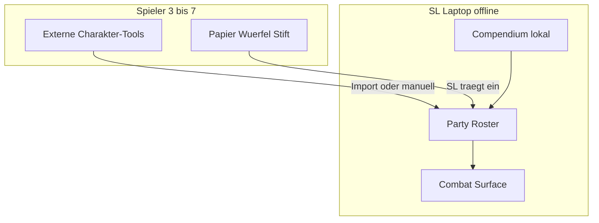
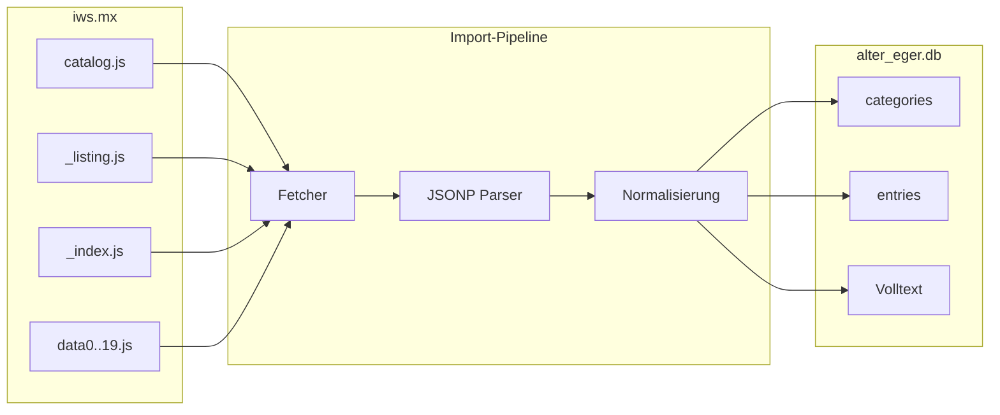
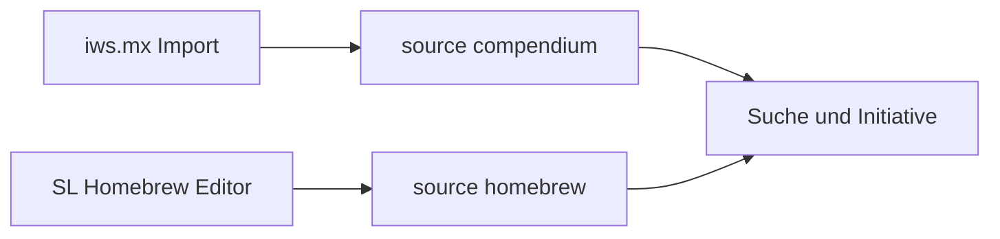
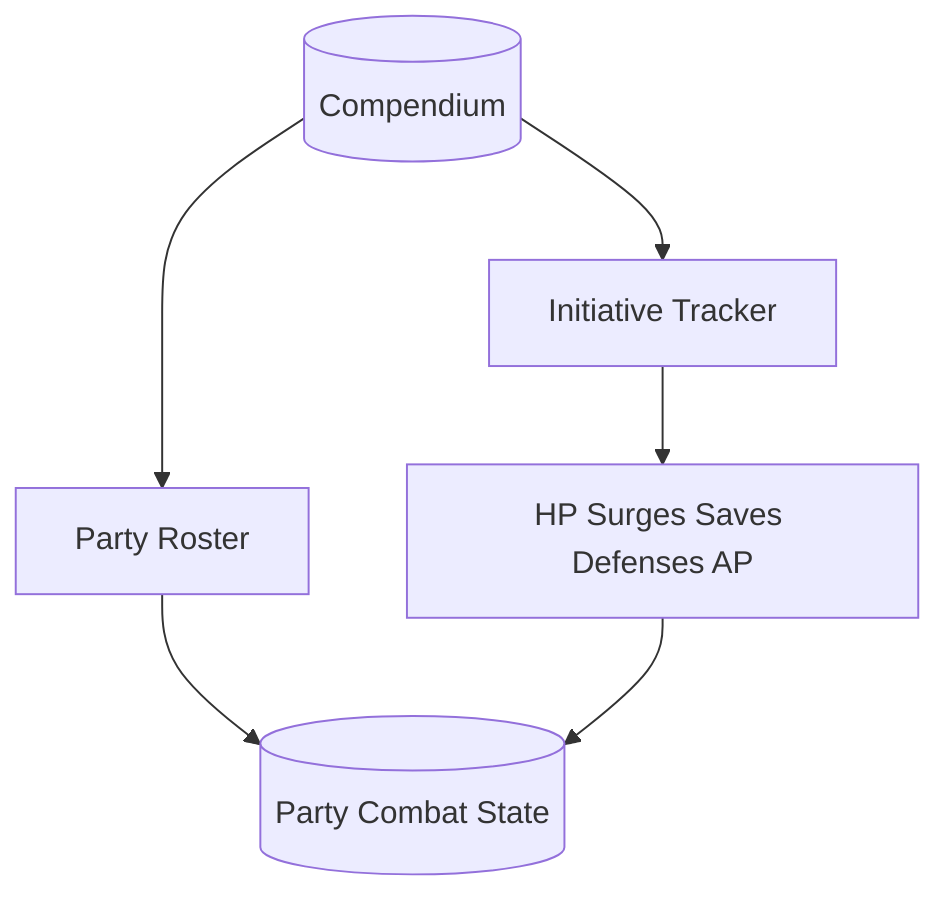

# Alter Ego — Projekt-Metadatei

Diese Datei beschreibt Zweck, Datenquelle, Architektur und Umsetzungsphasen für **Alter Ego**: ein offline-fähiges Werkzeug für D&D 4th Edition mit lokalem Compendium, Gruppen-Charakterverwaltung (3–7 Spieler) und SL-Oberfläche für Kampf und Initiative.

**Status:** Aktives Projekt — Spezifikation (`PROJECT.md`) plus lauffähige Web-App unter `src/` (Charakterblatt, Generator, GM, Party). Compendium-Import (`data/alter_eger.db`) steht noch aus (Phase 1).

---

## 1. Projektüberblick

| Feld | Wert |
|------|------|
| **Name** | Alter Ego |
| **Edition** | Dungeons & Dragons 4th Edition (4e) |
| **Zielgruppe** | Private Spielrunde, 3–7 Spieler |
| **Nutzer am Tisch** | Nur der Spielleiter (SL) am Laptop; Spieler nutzen externe digitale Tools oder Papier/Würfel/Stift |

### Drei Säulen

1. **Datenbank** — Lokales 1:1-Abbild des [iws.mx/dnd](https://iws.mx/dnd)-Compendiums (20 Kategorien, exakte Slugs und Spalten).
2. **Charaktere** — Party-Roster mit allen PCs; Erfassung per Import oder manuell; optional später eingebauter Builder (Vorbild: [D&D Beyond](https://www.dndbeyond.com/)).
3. **SL-Tischtool** — Party-Dashboard und Kampf-Oberfläche (Initiative, HP, Healing Surges, Saves, Verteidigungen, Action Points, Conditions).

### UX-Vorbild Charaktereditor

[D&D Beyond](https://www.dndbeyond.com/): geführter Wizard, gefilterte Wahlmöglichkeiten, Live-Validierung, Charakterblatt — angewendet auf **4e-Regeln** aus der lokalen Datenbank (nicht als 1:1-Klon der D&D-Beyond-5e-Oberfläche).

---

## 2. Notfall-Randbedingungen (alter SL-Laptop)

| Randbedingung | Konsequenz |
|---------------|------------|
| Alter/defekter SL-Laptop, veraltete Systeme | Offline-first, keine Cloud-Pflicht; schlanke Laufzeit |
| Gruppe 3–7 | `campaign` → bis zu 7 aktive PCs |
| Spieler: externe Tools oder Papier | App = **SL-Werkzeug**; Import oder manuelle Kernwerte |
| Nur SL am Laptop | Kein LAN-Multiplayer; optional Lesemodus am selben Gerät |
| SL sieht alle Charaktere | Party-Roster + Sheet-light pro PC |
| SL-Kampf-Oberfläche | Initiative + pro Teilnehmer: HP, Surges, Saves, AC/Fort/Ref/Will, AP, Conditions |



---

## 3. Quelle und Compliance

| Feld | Wert |
|------|------|
| **Öffentliche Quelle** | [https://iws.mx/dnd](https://iws.mx/dnd) |
| **Upstream** | [Sheep-y/trpg-dnd-4e-db](https://github.com/Sheep-y/trpg-dnd-4e-db) (Fan-Remake des D&D Insider Compendiums) |
| **Viewer-Stand** | 3.6.x (HTML/JS unter `4e_database_files/res/`) |
| **Lizenz Programm** | GNU **AGPL v3** |
| **Inhalt** | Wizards of the Coast Fan-Content / Compendium-Daten |

### Nutzungsrahmen (vom Projekt vorgesehen)

- **Nur lokaler, privater Gebrauch** an der Spieltisch-Runde.
- **Keine Weiterverbreitung** importierter Compendium-Rohdaten ohne eigene Lizenzprüfung.
- Bei späterer Veröffentlichung der App: AGPL-Pflichten und Fan-Content-Richtlinien beachten.

---

## 4. Datenbeschaffung (iws.mx)

Die Quelle ist **kein** live SQL-API, sondern ein **statischer JSONP-Export**:

**Basis-URL:** `https://iws.mx/dnd/4e_database_files/`

| Datei | Rolle |
|-------|--------|
| `catalog.js` | Kategorie-Slug → Eintragsanzahl |
| `{slug}/_listing.js` | Spaltennamen + Tabellenzeilen (Listenansicht) |
| `{slug}/_index.js` | Volltext-Index: `id → Plaintext` (Full Search) |
| `{slug}/data0.js` … `data19.js` | Eintragsinhalt: `id → HTML` (20 Shards: `parseInt(id.match(/\d+/)) % 20`) |

### URL-Konventionen (Quelle)

| Zweck | Muster | Beispiel |
|-------|--------|----------|
| Namenssuche, Kategorie | `?list.name.{slug}` | `?list.name.class` |
| Volltextsuche | `?list.full.{slug}` | `?list.full.power=fighter%20heal` |
| Eintrag | `?view.{slug}.{entrySlug}` | `?view.class.ardent` |

### Import-Empfehlung

**Kein fragiler DOM-Scraper.** Stattdessen strukturierter **JSONP-Importer**:

1. `catalog.js` laden und Kategorien validieren.
2. Pro Slug: `_listing.js`, `_index.js`, alle `data*.js` (0–19).
3. JSONP-Callback parsen (`od.reader.jsonp_*`).
4. In SQLite persistieren.



**Importer-Laufzeit:** einmalig auf einer moderneren Maschine; Ergebnis `data/alter_eger.db` per USB auf den SL-Laptop.

---

## 5. Katalog-Referenz und Validierung

Stand der Quelle (Abfrage iws.mx, für Import-Abnahme). **Catalog-Callback-Timestamp:** `20130616`.

### 5.1 `catalog.js` — erwartete Counts

| Slug | UI-Name | Erwartete Anzahl |
|------|---------|-----------------:|
| `power` | Power | 9415 |
| `monster` | Monster | 5326 |
| `feat` | Feat | 3261 |
| `item` | Item | 1964 |
| `background` | Background | 808 |
| `trap` | Trap / Terrain | 776 |
| `implement` | Implement | 647 |
| `weapon` | Weapon | 631 |
| `paragonpath` | Paragon Path | 577 |
| `armor` | Armor | 493 |
| `glossary` | Glossary | 458 |
| `ritual` | Ritual | 360 |
| `companion` | Companion | 193 |
| `deity` | Deity | 134 |
| `theme` | Theme | 116 |
| `epicdestiny` | Epic Destiny | 115 |
| `class` | Class | 77 |
| `disease` | Disease | 69 |
| `race` | Race | 55 |
| `poison` | Poison | 38 |
| **Summe** | *(UI „Everything“ ≈ 25.513)* | **25.508** |

**Abnahme Phase 1:** Importierte Zeilen pro `category_slug` müssen exakt diese Counts treffen (±0).

### 5.2 `_listing.js` — Spalten pro Kategorie (1:1 übernehmen)

Diese Spaltennamen sind **verbindlich** für Tabellenköpfe, `listing_fields`-JSON und Homebrew-Formulare.

| Slug | Listing-Spalten |
|------|-----------------|
| `power` | ID, Name, ClassName, Level, Type, Action, Keywords, SourceBook |
| `monster` | ID, Name, Level, CombatRole, GroupRole, Size, CreatureType, SourceBook |
| `feat` | ID, Name, Tier, Prerequisite, SourceBook |
| `item` | ID, Name, Category, Type, Level, Cost, Rarity, SourceBook |
| `background` | ID, Name, Type, Campaign, Benefit, SourceBook |
| `trap` | ID, Name, Type, GroupRole, Level, SourceBook |
| `implement` | ID, Name, Type, Level, Cost, Rarity, SourceBook |
| `weapon` | ID, Name, Type, Level, Cost, Rarity, SourceBook |
| `paragonpath` | ID, Name, Prerequisite, SourceBook |
| `armor` | ID, Name, Type, Level, Cost, Rarity, SourceBook |
| `glossary` | ID, Name, Category, Type, SourceBook |
| `ritual` | ID, Name, Level, ComponentCost, Price, KeySkillDescription, SourceBook |
| `companion` | ID, Name, Type, Size, CreatureType, SourceBook |
| `deity` | ID, Name, Domains, Alignment, SourceBook |
| `theme` | ID, Name, Prerequisite, SourceBook |
| `epicdestiny` | ID, Name, Prerequisite, SourceBook |
| `class` | ID, Name, RoleName, PowerSourceText, KeyAbilities, SourceBook |
| `disease` | ID, Name, Level, SourceBook |
| `race` | ID, Name, Origin, DescriptionAttribute, Size, SourceBook |
| `poison` | ID, Name, Level, Cost, SourceBook |

### 5.3 Stichproben — Listing-Timestamps und Dateigrößen

Referenz-URLs zum erneuten Prüfen:

| Kategorie | URL `_listing.js` | JSONP-Datum (Prefix) | Größe ca. |
|-----------|-------------------|----------------------|-----------|
| `power` | [power/_listing.js](https://iws.mx/dnd/4e_database_files/power/_listing.js) | 20130703 | 1.6 MB |
| `class` | [class/_listing.js](https://iws.mx/dnd/4e_database_files/class/_listing.js) | 20130703 | 5.9 KB |
| `monster` | [monster/_listing.js](https://iws.mx/dnd/4e_database_files/monster/_listing.js) | 20130703 | 656 KB |
| `feat` | [feat/_listing.js](https://iws.mx/dnd/4e_database_files/feat/_listing.js) | *(im Callback)* | 448 KB |
| `item` | [item/_listing.js](https://iws.mx/dnd/4e_database_files/item/_listing.js) | 20130703 | 218 KB |

**Stichprobe Eintrags-HTML:** [class/data0.js](https://iws.mx/dnd/4e_database_files/class/data0.js) — Keys wie `class529`, Werte als HTML-Fragmente.

### 5.4 Beziehungslogik (für Rules Engine / Builder)

- **Prerequisites:** `feat`, `theme`, `paragonpath`, `epicdestiny` → Feld `Prerequisite` (komplexe Abhängigkeiten).
- **Klassen / Powers:** `ClassName`, `Level`, `Type`, `Keywords` auf `power`.
- **Glossary:** Quick-Lookup von Regelbegriffen (Burst, Regeneration, …) wie im iws.mx-Viewer.
- **Items:** Überkategorie `item` plus Unterkategorien `weapon`, `armor`, `implement` (v3.6-Regrouping im Upstream).

---

## 6. Teil 1 — Lokale Datenbank (Schema)

### Ziel

1:1-Spiegel der 20 Kategorien inkl. Original-IDs (`class529`, `power1234`, …) und Listing-Spalten.

### Tabellen (Vorschlag SQLite)

```sql
-- Metadaten der 20 Kategorien (aus catalog.js + UI-Namen)
categories (
  slug TEXT PRIMARY KEY,
  display_name TEXT NOT NULL,
  entry_count INTEGER NOT NULL
);

-- Spalten pro Kategorie (aus _listing.js, Reihenfolge = ordinal)
category_columns (
  category_slug TEXT NOT NULL,
  column_name TEXT NOT NULL,
  ordinal INTEGER NOT NULL,
  PRIMARY KEY (category_slug, column_name)
);

-- Alle Compendium- und Homebrew-Einträge
entries (
  id TEXT PRIMARY KEY,
  category_slug TEXT NOT NULL,
  source TEXT NOT NULL CHECK (source IN ('compendium', 'homebrew')),
  campaign_id TEXT NULL,
  listing_fields JSON NOT NULL,
  body_html TEXT,
  index_text TEXT,
  created_at TEXT,
  updated_at TEXT
);

-- Optional: extrahierte Querverweise (Glossary, Power-Keywords)
entry_links (
  from_entry_id TEXT NOT NULL,
  to_entry_id TEXT,
  link_text TEXT,
  link_type TEXT
);
```

### Feld `source` (Homebrew-Vorbereitung)

| Wert | Bedeutung |
|------|-----------|
| `compendium` | Import von iws.mx; ID unverändert |
| `homebrew` | SL-eigene Inhalte; ID-Präfix `hb_{category}_` + UUID |

**Re-Import-Regel:** Beim Voll-Import nur `DELETE FROM entries WHERE source = 'compendium'` — Homebrew bleibt erhalten.

### Abnahmekriterien Phase 1

- [ ] Counts pro Kategorie = Abschnitt 5.1
- [ ] Spalten je Kategorie = Abschnitt 5.2
- [ ] Stichproben: `body_html` nicht leer für bekannte IDs
- [ ] Volltext (`index_text`) für Full Search durchsuchbar

---

## 7. SL-eigene Monster und Items (Homebrew)

Die 1:1-iws.mx-Struktur **blockiert** Homebrew nicht; sie ist nur auf Compendium-Import ausgelegt. Erweiterung **additiv**:

| Aspekt | Umsetzung |
|--------|-----------|
| Speicher | Gleiche Tabelle `entries`, `source = 'homebrew'` |
| Kategorien | Gleiche Slugs (`monster`, `item`, `weapon`, …) |
| IDs | `hb_monster_{uuid}` usw. — keine Kollision mit Compendium |
| Suche / Initiative | Filter: Offiziell / Eigen / Alle |
| Editor (später) | Minimal: Name, Level, HP, AC, Initiative; erweitert: HTML-Beschreibung |
| Vorlage | Compendium-Eintrag duplizieren → Homebrew-Kopie |
| Schnellanlage | Optional `combatants` nur für Initiative ohne vollen Eintrag |



---

## 8. Teil 2 — Charaktere und Gruppe

### Party-Modell

| Tabelle / Entität | Inhalt |
|-------------------|--------|
| `campaign` | Name, Notizen |
| `character` | Spielername, Race/Class/Level, Verknüpfung zu Compendium-IDs wo möglich |
| `character_combat` | HP current/max, bloodied, dying, surge_used/max, action_points, initiative |
| `character_saves` | STR/DEX/CON/INT/WIS/CHA; aktive End-of-turn-Saves |
| `character_conditions` | Conditions + Notizen |

### Import-Priorität (Spieler-Charaktere)

1. **Manuell** durch SL (Papier-Spieler) — **MVP**
2. **Datei-Import** (z. B. `.dnd4e` / Character Builder XML), falls verfügbar
3. **Eingebauter Builder** (später)

### 4e-Builder-Ablauf (wenn intern)

Race → Class (inkl. Hybrid) → Ability Scores → Background → Theme → Feats → Powers → Equipment → Paragon Path (11+) → Epic Destiny (21+) → Review

### Rules Engine (später)

Parst `Prerequisite`, `Tier`, `Level`, `Keywords`; Glossary-Lookup; liest **nur** aus lokaler DB.

---

## 9. Teil 3 — SL-Oberfläche „Combat & Party“

**Priorität für den Notfall-Einsatz** (vor vollständigem Builder).

### Party-Dashboard

- Alle 3–7 PCs: Name, Level, HP-Balken, Surges, optional AC/Defenses.

### Initiative-Oberfläche

- Sortierte Liste: PCs + NPCs/Monster (Compendium, Homebrew oder Schnellanlage).
- Runde/Zug: nächster Zug, Verzögerung, Runde beenden.

### Pro Teilnehmer (kampfrelevant)

| Feld | UI |
|------|-----|
| HP | aktuell/max, Buttons −1/−5/heal |
| Healing Surges | verbraucht / verfügbar |
| Saving Throws | 6 Attribute + laufende Save-Ends |
| Verteidigungen | AC, Fortitude, Reflex, Will |
| Action Points | Zähler |
| Conditions | aus Glossary verlinkbar + Freitext |

### Monster-Schnellzugriff

Aus `monster` (und Homebrew) Name, HP, Initiative in die Initiative-Liste übernehmen.

### Performance-Ziele

- Große Touch-/Klick-Flächen, wenig Animation.
- Zielbrowser: Firefox ESR oder älteres Chromium; IE11 nur falls zwingend (im Projekt vermeiden).



---

## 10. Architektur (alter Laptop)

| Schicht | Empfehlung |
|---------|------------|
| **Daten** | SQLite — eine Datei `data/alter_eger.db`, Backup = Datei kopieren |
| **UI** | Statisches HTML + CSS + Vanilla JS (evtl. minimales jQuery wie iws.mx) |
| **Start** | `file://` oder lokaler Mini-Server; **kein** Cloud-Account |
| **Importer** | Python-Skript unter `tools/importer/` (einmalig, nicht am Tisch) |

### Nicht empfohlen am Tisch

Electron, Node-Server, WebSockets, schwere SPA-Frameworks, Cloud-Sync.

### Ordnerstruktur (Ist-Stand)

```
Alter_Eger/
├── PROJECT.md          ← diese Datei (Gesamtspezifikation)
├── README.md           ← Schnellstart
├── doc/                ← lebende Dokumentation (Deutsch/Englisch)
├── metadata/           ← Editor-, Import-, Katalog-Metadaten
├── rules/              ← UI- und Flow-Regeln (Englisch)
├── src/                ← Web-App (Hub, Blatt, Generator, GM, Party)
│   ├── index.html      ← Home
│   ├── sheet/          ← Charakterblatt Seite 1
│   ├── editor/         ← Charaktergenerator (Wizard)
│   ├── gm/             ← SL Party-Ansicht
│   ├── party/          ← Party-JSON + index.json
│   └── character/      ← Modell, Speicher, Import/Export
├── scripts/            ← PDF-Export, Party-Index
├── data/
│   ├── samples/        ← Compendium-Stub bis Phase 1
│   └── alter_eger.db   ← nach Import (Phase 1)
└── tools/
    └── importer/       ← JSONP → SQLite (Phase 1)
```

Früherer Arbeitsstand lag unter `C:\Users\masch\Projects\dnd4e-character-sheet` — Inhalt ist in dieses Repo konsolidiert.

---

## 11. Phasen-Roadmap

| Phase | Liefergebnis | Code? |
|-------|----------------|-------|
| **0** | `PROJECT.md` (diese Metadatei) | — | Erledigt |
| **1** | Importer + SQLite-Compendium (20 Kategorien, validiert) | Ja | Offen |
| **2** | SL Party-Roster + manuelle PC-Erfassung (3–7) | Ja | **Teilweise** (`src/gm/`, `src/party/`) |
| **3** | SL Combat Surface (Initiative, alle Kampf-Werte) | Ja | Offen (GM noch ohne vollen Kampf-Tracker) |
| **4** | Compendium-Browser für SL (Suche wie iws.mx) | Ja | Offen |
| **5** | Charakter-Builder (D&D-Beyond-Flow) + optional `.dnd4e` | Ja | **Teilweise** (`src/editor/`, Stub-Compendium) |
| **6** | SL Homebrew: eigene Monster & Items | Ja | Offen |

**Aktuell:** Phasen 0, 2 und 5 sind im Code begonnen; Phase 1 (Compendium-Import) ist der nächste große Block. Details: [doc/project.md](doc/project.md), [doc/files.md](doc/files.md).

---

## 12. Risiken und Mitigation

| Risiko | Mitigation |
|--------|------------|
| Schema-Drift iws.mx | Spalten aus `_listing.js` parsen, nicht hardcoden (Referenz: Abschnitt 5.2) |
| HTML in Einträgen | `body_html` roh speichern; strukturiertes Parsing später |
| AGPL + Wizards-IP | Privatnutzung dokumentieren; keine Rohdaten-Weitergabe |
| Homebrew vs. Re-Import | Nur `source=compendium` ersetzen |
| Alter Browser | Vanilla JS, progressive Enhancement, Tests auf SL-OS |

---

## 13. Offene Punkte (optional)

- Betriebssystem des SL-Laptops (Windows-Version) → Mindest-Browser festlegen.
- Welche **externen Charakter-Tools** die Spieler nutzen → Import-Format Phase 5 (`.dnd4e`, PDF, nur Papier).

---

## 14. Änderungshistorie dieser Metadatei

| Datum | Änderung |
|-------|----------|
| 2026-05-21 | Erstversion Phase 0: Spezifikation aus Projektplan, Katalog-Validierung iws.mx |
| 2026-05-23 | Konsolidierung: Web-App aus `dnd4e-character-sheet` nach `Alter_Eger` übernommen; Ist-Struktur und Phasenstand aktualisiert |
