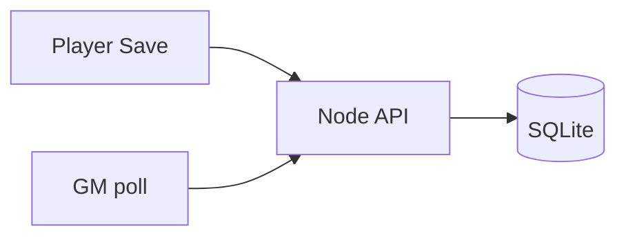

# Roadmap and plans — Alter Ego

**Last updated:** 2026-05-24

Phases align with [PROJECT.md](../PROJECT.md) §11. **Completed** items include the online campaign MVP (May 2026).

---

## Delivery modes (how the table uses the app)

| Mode | Audience | Host burden | Character handoff |
|------|----------|-------------|-------------------|
| **A. Online campaign** (recommended) | Players + GM in browser | Webhosting or VPS + `npm run server` | Save → API → GM polling |
| **B. Desktop app** (optional) | Install `.msi` / `.dmg` | Build per OS; Mac via CI | JSON export or online API |
| **C. Backup** | Any | None extra | JSON files, GM import |

Details: [deploy-hosting.md](deploy-hosting.md) (SSH/SFTP/Git), [deploy-online.md](deploy-online.md) (VPS/proxy), [mac-build-without-mac.md](mac-build-without-mac.md), [architecture.md](architecture.md).

---

## Phase overview

| Phase | Focus | Code? | Status |
|-------|--------|-------|--------|
| **0** | Specification (`PROJECT.md`) | — | Done |
| **0b** | Playable sheet + formulas | Yes | Done |
| **0c** | Character generator (stub compendium) | Yes | Done |
| **0d** | Vite build + role launcher | Yes | Done |
| **0e** | Desktop encapsulation (Tauri) | Yes | Done |
| **0f** | **Online campaign API + sync** | Yes | **Done** |
| **1** | Compendium import → `alter_eger.db` | Yes | Open |
| **2** | GM party roster (combat-prep) | Partial | Partial |
| **3** | GM combat surface | Yes | Open |
| **3a** | **Game editor** (encounter roster, NPC instances, editor bridge) | Yes | **Done** — [game-editor.md](game-editor.md) |
| **4** | Compendium browser (SL) | Yes | Open |
| **5** | Builder polish + `.dnd4e` import | Partial | **In progress** — player UX gate + guided wizard done (2026-05-24) |
| **6** | SL homebrew editor | Yes | Open |

---

## Completed plan: Online campaign sync

Implemented per product decision: **no JSON shuffle** for normal play.

| Step | Deliverable | Location |
|------|-------------|----------|
| 1 | Express API + SQLite | `server/` |
| 2 | Campaign tokens + routes | `server/routes/campaigns.mjs`, `server/auth.mjs` |
| 3 | Client API + session | `src/character/campaign-api.js`, `campaign-session.js` |
| 4 | Player join flow | `src/join/` |
| 5 | Editor sync on Save | `src/editor/editor.js` |
| 6 | GM live party (polling) | `src/gm/gm.js` |
| 7 | Deploy documentation | [deploy-online.md](deploy-online.md) |
| 8 | API smoke test script | `scripts/test-campaign-api.mjs` |

---

## Near-term backlog (suggested order)

| Priority | Item | Notes |
|----------|------|--------|
| P1 | **Compendium live on deploy** — full `alter_eger.db`, not stub; all picker categories usable | [todos.md § Deployment — compendium](todos.md#deployment--compendium-must-be-live); blocks “real” production for character builder |
| P1 | Deploy online campaign to production hosting | [deploy-hosting.md](deploy-hosting.md) then [deploy-online.md](deploy-online.md) |
| P1 | Set `TOKEN_PEPPER`, `CORS_ORIGIN`, `PUBLIC_APP_URL` | Security |
| P2 | **Character generator player UX** | Prominent Create new; hide JSON import for players; guided step flow — [todos.md § Character generator player UX](todos.md#open--character-generator-player-ux-p2) |
| P2 | Phase 1: compendium importer + `alter_eger.db` | Unblocks full rules in editor |
| P3 | GM DELETE character endpoint | Optional cleanup |
| P3 | SSE instead of 4 s polling | Nicer “instant” UX |
| P3 | Game editor MVP (`src/game/`) + editor deep-link | [game-editor.md](game-editor.md) G2–G3 |
| P4 | Phase 3: combat tracker MVP (reads encounter roster) | PROJECT.md §9 |

---

## Deferred / optional

- Autosave debounce tuning (partial: editor debounces sync ~800 ms)
- npm `package-lock.json` in repo for reproducible CI
- Docker image for API
- Player read-only view of party (not required)

---

## Related documents

| Document | Content |
|----------|---------|
| [requirements.md](requirements.md) | Full requirement IDs |
| [todos.md](todos.md) | Actionable checklist for agents and host |
| [tests.md](tests.md) | Verification |
| [project.md](project.md) | Summary for the table |
